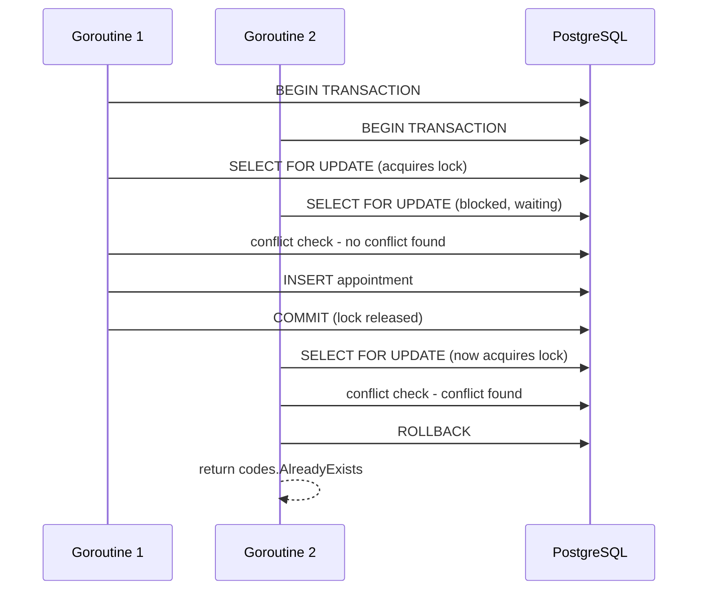

# Technical Decisions - Schedula

## How I Read This Assessment

When I first read the opening lines of the assessment, I immediately thought of Calendly. I began mapping out an MVP to build with shared calendars, availability windows. Then I saw the phrase "Independent problem-solving and delivery" and read through till the end.
The hardest part was not the technical implementation but knowing what not to build. Every interesting UX feature I thought of had a cost in complexity and that complexity had a cost on data consistency and correctness under concurrent load. This shaped every decision I made.

---

## Assumptions and Interpretations

### Single-User Personal Scheduling

The assessment did not specify who books appointments or for whom. I assumed a single-user personal scheduling system where each authenticated user manages their own calendar. No attendee management, no invites, no host/guest distinction. Adding any of these features would introduce premature complexity without a clear business justification from the brief.

When I first read the assessment I genuinely started designing an attendee system in my head. Shared calendars, invite links, a host and guest model. I had to stop myself because the moment you introduce attendees, the entire data model changes. You need an attendees table, an invite system, a notification layer to tell people about bookings, and the conflict definition becomes ambiguous fast. Whose conflict matters when two users share a slot? The host's? All attendees? That one feature would have doubled the scope and introduced questions the assessment brief never answered. I scoped it out and documented it as a stakeholder question instead.

### What Makes Up an Appointment

A title, description (optional), date, start time, end time and status. These fields cover the minimum viable information for any scheduling use case without making assumptions about the business domain. If the business needed appointment types or categories, the schema grows, the conflict logic would need to account for type-based rules and the calendar display would need grouping or colour coding per category.

### Conflict Definition

What constitutes a "schedule conflict" was left undefined. I interpreted a conflict as any time overlap between two appointments belonging to the same user. Cancelled appointments are excluded from conflict checks. Back-to-back appointment time slots are explicitly allowed. If the business wanted a buffer between appointments, the overlap query gets an extra interval parameter, the conflict error message changes and the frontend slot picker would need to reflect that constraint.

```mermaid
gantt
    title Conflict Detection - Overlap Rules
    dateFormat HH:mm
    axisFormat %H:%M

    section Existing
    Existing Appointment     :existing, 09:00, 60m

    section No Conflict
    Ends before start        :done, 07:00, 60m
    Starts after end         :done, 10:00, 60m
    Back to back (allowed)   :done, 10:00, 1m

    section Conflict
    Starts inside            :crit, 09:30, 60m
    Ends inside              :crit, 08:00, 90m
    Fully overlaps           :crit, 08:30, 120m
```



During testing I noticed the conflict error message was showing times one hour behind what the user actually booked. The bug was that the error message was formatting times in UTC rather than the user's local timezone. The fix was in the backend. The user's timezone is now fetched from the database before validation runs, and time.In(loc) is used to format the conflict message. A small thing but it would have been genuinely confusing to a user who books a 9am slot and gets told they are conflicting with something at 8am.

### Timezone Handling

The assessment made no mention of timezone handling. I assumed the system could be used from anywhere in the world, following a global-first approach. All times are stored in UTC in the database. The user's timezone is recorded at registration and used exclusively for display purposes. This ensures time data is consistent regardless of where a user accesses the system.

Timezone and week start preference are collected at registration rather than a separate settings page. This was a scope decision to keep the surface area small. A settings page would be the right place for these in a production system.

Known gap: if a user travels and their browser timezone shifts, appointments display in their registered timezone, not the local one. In a production system I would use `Intl.DateTimeFormat().resolvedOptions().timeZone` to detect the browser timezone on login and prompt the user to update their stored timezone if it differs, handling travel automatically without manual profile updates.

### What Was Deliberately Scoped Out

Attendee management, availability windows, appointment editing, admin roles and email notifications. None are essential to the core functionality of schedule management and would introduce complexity without a clear business justification from the assessment brief.

The assessment never said anything about email verification or OTP on login. I genuinely did not know if that was expected or out of scope. I made the call that it was not required for core functionality and proceeded with basic email and password auth. But if the answer had been the opposite, the system would look very different. Registration would need an unverified state, a verification token stored in the database with an expiry, an email provider integration and a confirmation step before the user can log in. The entire onboarding flow changes. I documented it as a question I would have asked rather than assuming it away silently.

---

## Architecture Decisions

Beyond the specified technical constraints of Go, gRPC and React (TypeScript), all other architectural decisions were mine to make. My mental framework was simple: choose the simplest tools that correctly solve the problem while achieving core functionality, then defend why.

### Why gRPC

gRPC was a given constraint but it was also the right choice for this system. It generates typed clients and server stubs directly from the proto file, so the contract between frontend and backend is never out of sync. There is no manually written REST client, no guessing at response shapes. All request and response types are defined once in the proto and generated from there.

### gRPC Gateway

Browsers cannot speak native gRPC. Rather than configuring an Envoy proxy, which would increase complexity and operational overhead, I used gRPC-gateway to expose HTTP/JSON endpoints from the backend. The React frontend communicates over REST while the backend remains a pure gRPC service. This is good enough for the scope of this assessment and solves the problem cleanly without a separate REST layer.

### Interceptor Chain Order

The gRPC interceptor chain runs in this order: rate limiter, then logging, then auth. The order matters. Rate limiting runs first so abusive requests are rejected before any work is done. Logging runs second so every request is captured regardless of whether auth passes or fails, giving a complete picture of traffic. Auth runs last because it only needs to protect business logic, not the layers before it. Each interceptor has one job and does not need to know about the others. This is wired in `cmd/server/main.go`.

### Data Persistence - PostgreSQL

A scheduling system with the possibility of concurrent booking attempts requires high transactional integrity. PostgreSQL's ACID compliance guarantees this. Two requests checking for conflicts simultaneously cannot both succeed. Postgres also supports SELECT FOR UPDATE natively, handles time-based ranges efficiently and enforces relational integrity via foreign keys.

### Raw database/sql Over ORM

I chose raw database/sql over an ORM like GORM. For the current scope and scale, it offers explicit transaction control using SELECT FOR UPDATE and full control over query logic. An ORM would abstract the most critical part of the system, making it hard to reason about and review.

### Shared Schema Multi-Tenancy

One database, one set of tables, all users coexist. Data isolation is enforced at the application layer: every query is scoped to the authenticated user's ID. This approach is standard at this scale and eliminates the operational overhead of schema-per-tenant or database-per-tenant models. The known risk is a missing WHERE clause leaking cross-user data, mitigated by consistent parameterized queries throughout the codebase.

### Docker and Docker Compose

Docker Compose packages all three services (PostgreSQL, backend and frontend) into a single command setup. This ensures consistent package versions and enables the reviewer to run the entire system without manual configuration. The Go backend is configured to wait for PostgreSQL to be healthy before starting, preventing startup race conditions.

---

## Auth and Security

Auth was not something I was willing to skip or half-implement. I made a deliberate set of tradeoffs, picked the simplest approach that was honest about its gaps and documented every one of them.

### JWT Over Sessions

Sessions require a store and cookies, both of which are incompatible with gRPC metadata transport. JWT tokens are stateless, passed via gRPC metadata on every request and verified without a database lookup. The tradeoff is that tokens cannot be invalidated before expiry without a token blacklist. In production, short-lived tokens with refresh token rotation and a Redis blacklist would address this.

### LocalStorage Over HttpOnly Cookies

JWT tokens are stored in localStorage on the React frontend. This is vulnerable to XSS attacks because any malicious script on the page can read the token. The production alternative is HttpOnly cookies, which are not accessible to JavaScript. I chose localStorage because HttpOnly cookies require additional changes to gRPC-gateway response headers and CSRF token handling. This is a known security gap, documented honestly.

### Token Expiry

JWT tokens expire after 24 hours. Short enough to limit exposure if a token is stolen, long enough that users are not constantly re-authenticating. A production system would use short-lived access tokens (15 minutes) with rotating refresh tokens.

### Email Enumeration

Instead of returning AlreadyExists when a duplicate email is submitted on registration, which leaks information about registered accounts, I return InvalidArgument instead. This makes duplicate emails indistinguishable from any other invalid input, preventing attackers from using the registration endpoint to enumerate valid accounts. The status code itself was the leak, not just the message. This is in `internal/auth/service.go` where the pq error code 23505 is caught and mapped to `codes.InvalidArgument`.

### Rate Limiting

Rate limiting is applied to the Register and Login endpoints only. These are the public attack surface, unauthenticated endpoints vulnerable to brute force and credential stuffing. Authenticated endpoints are already protected by JWT verification, making rate limiting redundant there. The implementation is an in-memory IP-based counter: 10 requests per minute per IP. A known weakness is that users behind a shared IP, like a corporate network or mobile carrier, share the same limit so a busy office could hit the ceiling through normal usage.

### SQL Injection Protection

Every database query uses parameterized queries ($1, $2). User input is never concatenated into query strings. The database driver sends values separately from the query syntax, completely removing the attack surface for SQL injection.

### No Account Lockout

Rate limiting covers bulk brute force attacks. Full account lockout introduces user experience issues because legitimate users can be locked out, and it requires an unlock mechanism that adds scope. This is a documented gap.

---

## Concurrency and Data Integrity

Concurrency is the most critical engineering problem in a schedule management system. A single user could trigger simultaneous booking requests from a double tap, network retry or separate authenticated devices. Without proper handling, both requests could pass the conflict check before either commits, resulting in a double booking.

### SELECT FOR UPDATE

All conflict checks run inside a PostgreSQL transaction using SELECT FOR UPDATE. This applies pessimistic locking on the user's appointment rows for the duration of the conflict check and insert. Any concurrent request for the same user is forced to wait until the first transaction commits before proceeding.

```sql
SELECT id FROM appointments
WHERE user_id = $1 AND status = 'scheduled'
FOR UPDATE
```



### Idempotency Keys

Every create request carries a client-generated idempotency key. If a request retries due to network failure, the backend detects the duplicate key and returns the original response without a double insert. This prevents duplicate appointments from client retries.

### Trade-off Acknowledged

This approach prioritises strict consistency over throughput. Under simultaneous booking attempts, one request succeeds and the other receives a clear conflict error. A softer approach would queue the losing request and retry, but this adds complexity without clear benefit for a scheduling system where a double booking is worse than a rejected request.

---

## Appointment Logic

The appointment logic is where I was most opinionated. A scheduling system that loses or corrupts booking records is worse than no system at all, so I prioritised correctness over convenience at every decision point here.

### Cancel Over Delete

Appointments are never hard deleted. When a user cancels, the status is set to cancelled and the record remains permanently. A hard delete leaves no trace of what was booked, when it was booked or why it was removed. Keeping cancelled records means the database always reflects a complete picture of all scheduling activity. This principle is standard in fintech systems where audit trails are not optional.

### Three Status Model

Appointments exist in one of three states: scheduled, completed or cancelled.

The completed status is derived lazily. Rather than running a background job or cron task to periodically update expired appointments, the status update happens inside the GetAppointments transaction before results are returned. This means the database always reflects accurate statuses without any infrastructure overhead. The tradeoff is that a completed appointment is only marked in the database when the user next fetches their appointments. If a user never returns to the app, those appointments stay as scheduled in the database forever since the browser has no persistent process to trigger the update without an active request.

```sql
UPDATE appointments
SET status = 'completed', updated_at = NOW()
WHERE user_id = $1 AND status = 'scheduled' AND end_time < NOW()
```

### Cancel Restrictions

Only scheduled appointments can be cancelled. If the update query affects zero rows, whether because the appointment does not exist, belongs to another user, or is already completed or cancelled, the service returns codes.NotFound. The frontend reflects this by only showing the cancel button on scheduled appointments.

### Recurring Appointments - Materialized Rows

Each occurrence is inserted as a real, independent database row. All occurrences share a recurrence_group_id that links them together. I chose materialization over on-the-fly expansion for one critical reason: it keeps conflict detection and concurrency handling identical for both recurring and non-recurring appointments. Every occurrence is a real, lockable, queryable row with no special cases needed in the conflict detection logic.

All occurrences are conflict-checked before any row is inserted. If one occurrence conflicts, the entire transaction is rolled back with no partial inserts. Some succeed and others fail is not an acceptable outcome for a booking system. The scope was deliberately limited to weekly recurrence with a maximum of 4 occurrences to prevent runaway data generation while still demonstrating the approach.

### Cancelled and Rebooked Slot Deduplication

After building this feature I noticed a problem during testing. When I cancelled an appointment and booked the same slot again, the cancelled block on the calendar was visually overshadowing the new active appointment. Both rows existed correctly in the database which was right for the audit trail, but the calendar was rendering both at the same pixel position.

My first instinct was to filter cancelled appointments out at the backend query level. I stepped back from that because it would silently drop records from the response and break the audit trail the soft delete was designed to preserve. The fix belongs on the frontend. The calendar now runs a two pass filter: it suppresses a cancelled appointment from display only when an active or completed appointment overlaps the exact same time range. If the slot is never rebooked the cancelled block remains visible. The database always returns everything, the UI decides what to show.

### No Editing

Appointments cannot be edited after creation. This was a deliberate scope decision. Editing introduces complexity: the conflict check must be re-run excluding the current appointment, recurring group members must be handled independently, and the audit trail becomes harder to reason about. The current flow of cancel and rebook keeps the data model clean and the audit trail unambiguous. The user pays a small UX cost but the system stays correct and simple.

---

## Testing Strategy

### Unit Tests - sqlmock

Unit tests use testify/assert for assertions and DATA-DOG/go-sqlmock to mock the database at the driver level. Tests are written in the same package as the code they test (white-box testing) which gives direct access to unexported types and internals without any workarounds.

Critical paths covered: conflict detection, idempotency hit, recurring occurrence generation, lazy status update on fetch, cancel success and failure paths, and all authentication validation paths.

### Test Context Injection - WithUserID

Go's context package uses typed keys to store values, and the auth package's context key is unexported. To inject a user ID in tests without exposing the key itself, I exported a WithUserID helper function in `internal/auth/middleware.go`. This lets tests set up authenticated context cleanly without the test files needing to reach into unexported internals or live in the auth package just to access the key.

### bcrypt.MinCost in Tests

bcrypt is intentionally slow by design, it uses computational cost to make password cracking expensive. In tests, using the default cost adds noticeable time without testing anything different. MinCost keeps the test suite fast while the hashing logic itself remains unchanged.

### Integration Test - Real PostgreSQL

SELECT FOR UPDATE locking behaviour lives in the PostgreSQL engine and cannot be faked with sqlmock. A dedicated integration test runs against the real PostgreSQL instance and fires two goroutines simultaneously attempting to book the same slot. The test asserts exactly one succeeds and the other receives a conflict error. This test is tagged with //go:build integration so it is excluded from normal go test ./... runs.

### Honest Limitation

Unit tests verify the logic around locking, not the locking behaviour itself. The integration test covers the actual concurrent behaviour. In a production codebase, a full integration suite against a live database would replace sqlmock entirely for critical paths.

---

## Logging

I used Go's standard log/slog package and output JSON. This means the logs can be piped directly into aggregation tools like Datadog or CloudWatch without any parsing configuration on their end.

Logging is intentionally selective. Routine reads like GetAppointments are silent. Only meaningful writes (create, cancel, register) and errors are logged. This keeps logs signal-rich and avoids noise in production.

A gRPC interceptor handles logging at the request level, capturing method name, user ID, duration and status code in one place without scattering log statements across service methods. An internalErr helper logs and returns the gRPC error in a single call, preventing double logging between the interceptor and the service layer.

---

## Frontend

React Query manages all server state. Appointments are fetched, cached and invalidated automatically on create or cancel without manual useEffect juggling. This keeps the calendar always in sync with the backend.

Form validation uses Zod without react-hook-form. Zod alone was sufficient for the validation requirements and adding another abstraction layer was unnecessary.

The calendar displays appointments in a weekly grid view, the most intuitive representation for time-based scheduling. Appointments are colour coded by status: black for scheduled, blue for completed, grey with strikethrough for cancelled.

Clicking an appointment opens a slide-in detail panel rather than showing an inline cancel button on the appointment block. A small X button on a calendar block is easy to miss and gives no context. The panel shows the full appointment details and the cancel button only when the appointment is still scheduled. Touching anywhere outside the panel closes it.

After building this I found a bug where the cancel button remained active in the panel even after the appointment had already been cancelled. The panel was holding onto the old appointment state. I was relying on React Query to refetch and update the UI but the refetch is asynchronous, so there was a window where the network call was still in flight and the panel was still showing stale data. The fix was passing the updated appointment directly through the onCancelled callback so the panel state updates immediately on success without waiting for a refetch.

All times are displayed in the user's local timezone, converted from UTC on the frontend using the timezone stored at registration.

---

## Open-Ended Considerations

### Recurring Appointments

A stakeholder mentioned "it would be nice if appointments could repeat." I implemented a subset of this rather than the full thing, and the implementation choice was deliberate.

Each recurring occurrence is inserted as a real independent database row at creation time. All occurrences share a recurrence_group_id that links them together. The alternative would be storing one row with a recurrence rule and expanding occurrences at read time, similar to how calendar applications like Google Calendar work internally.

I chose materialization for one reason that matters more than anything else in this system: conflict detection. Every occurrence is a real, lockable, queryable row. The SELECT FOR UPDATE and overlap check logic is identical for recurring and non-recurring appointments. There are no special cases, no rule parsing at query time, no edge cases around what happens when you try to lock a virtual row that does not exist in the database. Concurrency handling stays simple and correct.

The tradeoffs are real. Materialized rows use more storage. Editing or cancelling a single occurrence out of a group requires identifying it by recurrence_group_id and handling it separately. Generating thousands of occurrences upfront would be impractical. That is why I capped it at weekly recurrence with a maximum of 4 occurrences for this assessment. The cap is not a technical limitation, it is a scope boundary that prevents runaway data while demonstrating the approach.

The production path is full RRULE support with a higher or configurable occurrence limit, individual occurrence exception handling, and the option to edit one occurrence or all future occurrences in a group. The foundation is already in place since the recurrence_group_id field and the materialized row pattern support all of this without a schema change.

### Data Persistence

I chose PostgreSQL for reasons that connect directly to the problems this system has to solve.

A scheduling system has three hard requirements from its database. It needs to prevent double bookings under concurrent load, which requires real transactions with row-level locking. It needs to query time ranges efficiently to find conflicts and display appointments on a calendar. It needs referential integrity to ensure appointments always belong to a valid user.

PostgreSQL handles all three natively. SELECT FOR UPDATE gives pessimistic row locking inside a transaction. Index scans on start_time and end_time make range queries fast. Foreign keys enforce that an appointment cannot exist without a user. These are not nice-to-haves, they are structural requirements and Postgres provides all of them out of the box.

The alternative of a NoSQL database like MongoDB would require application-level conflict detection without the transactional guarantees. You could implement optimistic concurrency with version fields but the logic becomes complex and the failure modes are harder to reason about. The simplest correct solution for a system where data integrity is the hardest problem is a relational database with strong ACID guarantees.

Raw database/sql was chosen over an ORM because the most important queries in the system, the conflict check and the SELECT FOR UPDATE lock, need to be explicit and reviewable. An ORM generating those queries in the background would make the most critical part of the system opaque.

### Scalability

The question is what breaks first when this service runs as multiple instances behind a load balancer, and what the fix is for each thing.

**Rate limiter breaks immediately.** The current implementation is an in-memory map inside a single running process. Two instances means two separate maps. An attacker sending 10 requests to each instance bypasses the limit entirely. The fix is replacing the in-memory counter with a Redis counter shared across all instances. Each instance increments the same key in Redis on every request. This is a small code change with a big impact on correctness.

**Connection pool needs tuning.** Go's database/sql has a connection pool by default but it is not configured. Under load, hundreds of goroutines competing for database connections will queue and slow down. Setting MaxOpenConns and MaxIdleConns explicitly, or switching to pgxpool for finer control, ensures predictable behaviour under concurrent traffic. This does not change any business logic, it is purely operational configuration.

**The lazy status update does not survive read replicas.** At scale, GetAppointments queries would move to a read replica to take load off the primary. Read replicas are read-only, so the UPDATE that marks completed appointments can no longer run inside the GetAppointments transaction. The lazy approach breaks. The replacement is a background worker running on a short interval, something like every minute, that marks completed appointments on the primary. The read query then becomes a pure read with no writes mixed in, which is what a replica expects.

**Auth adds a database query on every request.** Every authenticated request currently requires the JWT to be verified, but user data is not cached. As traffic grows, adding a Redis cache for user records with a short TTL reduces the number of Postgres queries significantly. A token blacklist in Redis also becomes necessary once logout and token revocation are required, since JWTs are stateless and cannot be invalidated without a shared store.

**Microservices are not the answer here.** Running multiple instances of the same monolith behind a load balancer is horizontal scaling and it is the right approach at this scale. Splitting auth and appointments into separate services would introduce network calls between them, distributed tracing requirements, separate deployment pipelines and a significant operational burden. The complexity cost is not justified by any real problem this system currently has. A well-structured monolith that scales horizontally is the correct architecture until there is a specific reason to split it, and there is not one here.

The order things break under real load is: rate limiter loses state across instances, connection pool exhausts under concurrency, lazy update creates write contention on read paths, then auth queries accumulate as a bottleneck. Each one has a clear fix and none of them require a rewrite of the core system.

---

## What I Would Do Differently With More Time

**Security** - The localStorage decision was a deliberate shortcut to avoid the CSRF handling and gRPC-gateway header changes that HttpOnly cookies require. Given more time I would make that trade, the XSS risk is real. I would pair it with short-lived access tokens (15 minutes) and rotating refresh tokens in a Redis blacklist so stolen tokens have a very short window. Account lockout after repeated failed logins would sit on top of the existing rate limiting for a more complete defence.

**Architecture** - grpc-gateway was the right call for the time available but it is technically a workaround. The correct production approach is gRPC-Web with an Envoy proxy, which keeps the entire stack speaking native gRPC without a translation layer. Idempotency keys would move from Postgres to Redis with automatic TTL expiry so old keys clean themselves up without a manual purge job. Connection pooling would be tuned explicitly with pgxpool and read replicas would separate GetAppointments queries from write operations as traffic grows.

**Appointments** - Edit functionality is the most impactful missing feature for users. Right now cancel and rebook works but it feels clunky for something as simple as moving a meeting 30 minutes. Implementing it properly requires re-running the conflict check excluding the current appointment and handling recurring group edits carefully. Browser timezone auto-detection on login using Intl.DateTimeFormat().resolvedOptions().timeZone would replace the manual timezone entry at registration. Full RRULE recurrence support for daily and monthly patterns would be the backend equivalent.

**Testing** - I would replace the sqlmock unit tests with a full integration suite against a live PostgreSQL instance. The mock tests verify logic but they cannot catch query bugs or index performance issues. Playwright E2E tests would cover the flows I manually tested during development, registration through booking through cancellation. Load testing with k6 would tell me how the SELECT FOR UPDATE locking holds up under hundreds of concurrent requests, not just two goroutines.

**Observability** - Right now if something goes wrong in production I have JSON logs and nothing else. I would add a Prometheus metrics endpoint tracking conflict rate, booking success rate, request latency per endpoint and failed login attempts. Conflict rate specifically tells you if users are fighting over slots, which is a signal the UX or the available time windows need attention. A Grafana dashboard would surface these patterns visually. OpenTelemetry distributed tracing would let me follow a single slow request from the React frontend through grpc-gateway into the Go service and down to the Postgres query to find exactly where time is being lost.

**Frontend** - A settings page so users can update their timezone and week start preference without re-registering. Month and day calendar views for different planning contexts. Clicking an empty time slot should pre-fill the start time in the create modal, it is a small detail but it makes the calendar feel like a real scheduling tool rather than a form with a calendar next to it. Drag and drop rescheduling would be the most impactful frontend addition for daily use.

---

## Questions I Would Have Asked

**Multi-user scheduling** - Would users ever need to book appointments with other users, sending invites, confirming attendance, or sharing calendars? I proceeded assuming single-user personal scheduling since no multi-party flow was specified. This assumption significantly shaped the data model: no attendees table, no invite system, no shared availability.

**Notifications** - Should users receive reminders before scheduled appointments via email, push or in-app? Notifications would change the architecture significantly, requiring a background job, a notification service and potentially a third-party provider like SendGrid. I left it out entirely. Adding it during this assessment without a real email provider would have been tough.

**Recurrence scope** - Beyond weekly repetition, what recurrence patterns does the business need? Daily, monthly, custom intervals? I implemented weekly recurrence with a maximum of 4 occurrences, the simplest subset that demonstrates the concept without the complexity of full RRULE support.

**Data retention** - How long should cancelled or completed appointments be retained? Should old records be purged after a certain period? I proceeded with indefinite retention where no records are ever deleted. At scale this becomes a real cost, a user with years of appointment history adds up and without a retention policy the appointments table grows without bound. In production, a data retention policy would be defined with the business and legal teams.

**Conflict definition** - Should back-to-back appointments be allowed or blocked? Should buffer time between appointments be a requirement? I interpreted a conflict as any time overlap and explicitly allowed back-to-back appointments. That is one question I would not have shipped without an answer in a real product.
